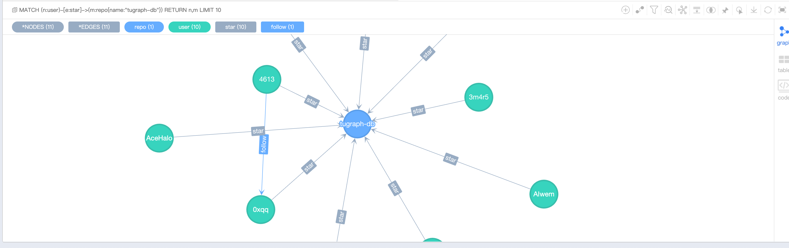
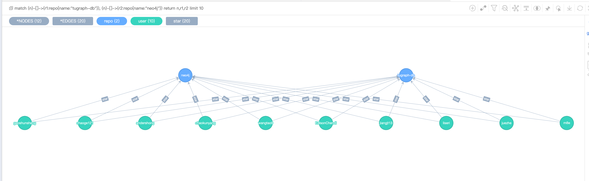
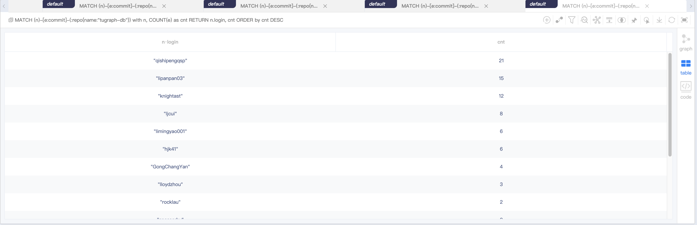
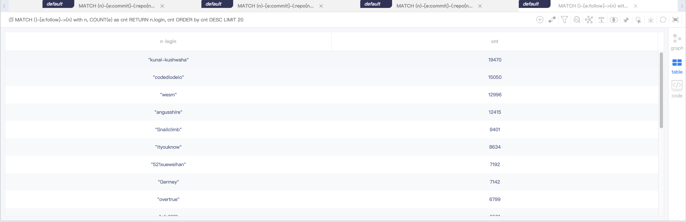
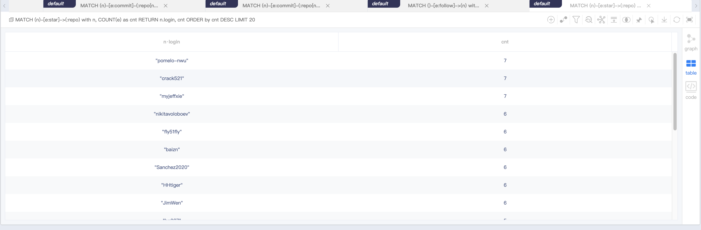
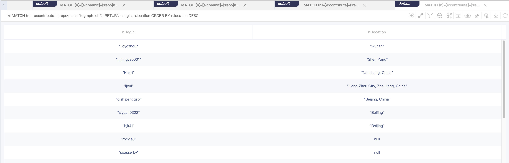

# README

## 关于

这是一个tugraph的Demo，背景是github上仓库(repo)和用户(user)的关系，包含follow、star，commit，contribute 4种关系。

**关键词**：tugraph demo、github

## 目录结构
- data: github数据，需要通过control.sh下载，包含repo、user、star、commit、contributor等数据
- scripts: 从github api获取数据的脚本
- case.cypher: 查询相关的Cypher语句
- control.sh: 控制TuGraph Server启动停止、下载与更新github数据的脚本
- lgraph.json: TuGraph Server启动的配置文件

## 使用说明

前置条件：TuGraph已安装

### 数据说明
爬取了截止到2023年3月23日，Graphscope / NebulaGraph / Neo4j / tugraph-db / G6 / graphin / G6VP 7个仓库和仓库的用户和用户的followers和following数据。

| label      | count     |
|------------|-----------|
| repo       | 7         |
| user       | 1,036,974 |
| star       | 33,686    |
| commit     | 78,594    |
| contribute | 537       |
| follow     | 3,157,363 |


### 数据导入

- 根据数据存放目录对应修改import.json里面的DATA_PATH
- 参考control.sh中的load函数，加载数据
- 参考control.sh中的start函数，启动TuGraph服务
- 启动TuGraph服务后，访问${HOST_IP}:7071，打开web页面，确认数据是否导入成功

### Cypher查询

参考TuGraph文档，在TuGraph的Web页面前端输入Cypher进行查询

## 使用展示
### 查询展示

#### 查询某个repo用户
```cypher
 MATCH (n:user)-[e:star]->(m:repo{name:"tugraph-db"}) RETURN n,m LIMIT 10
```

#### 查询两个repo共同的用户
```cypher
MATCH (n)-[]->(r1:repo{name:"tugraph-db"}), (n)-[]->(r2:repo{name:"neo4j"})
RETURN n,r1,r2 LIMIT 10
```

#### 查询谁是卷王
```cypher
 MATCH (n)-[e:commit]-(:repo{name:"tugraph-db"})
 WITH n, COUNT(e) AS cnt
 RETURN n.login, cnt ORDER by cnt DESC
```

#### 查询粉丝数最多的用户：
```cypher
 MATCH ()-[e:follow]->(n)
 WITH n, COUNT(e) AS cnt
 RETURN n.login, cnt ORDER BY cnt DESC LIMIT 20
```

#### 查询star数最多的用户：
```cypher
 MATCH (n)-[e:star]->(:repo)
 with n, COUNT(e) AS cnt
 RETURN n.login, cnt ORDER BY cnt DESC LIMIT 20
```

#### 查询某个repo的contributors的地理位置分布：
```cypher
 MATCH (n)-[e:contribute]-(:repo{name:"tugraph-db"})
 RETURN n.login, n.location ORDER BY n.location DESC
```

可以看出tugraph-db的贡献者在北京的最多。
