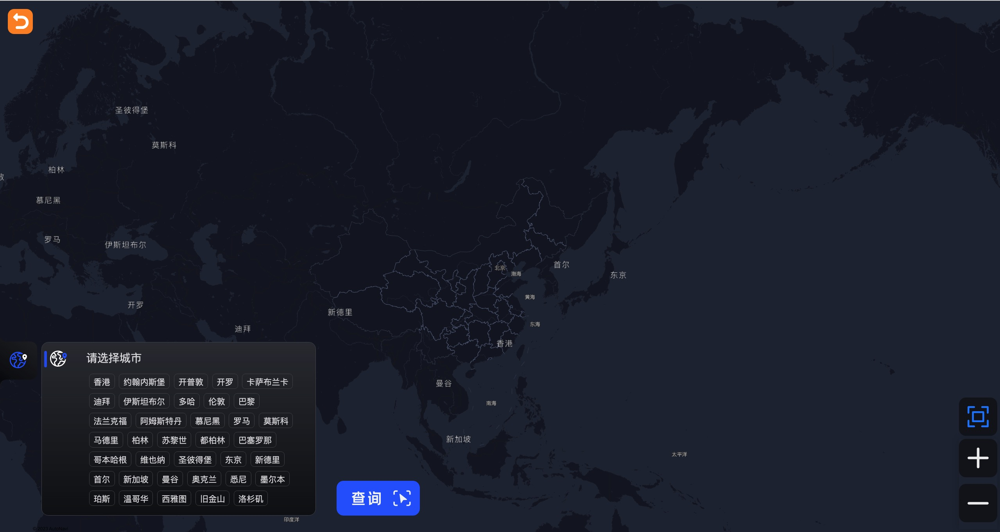
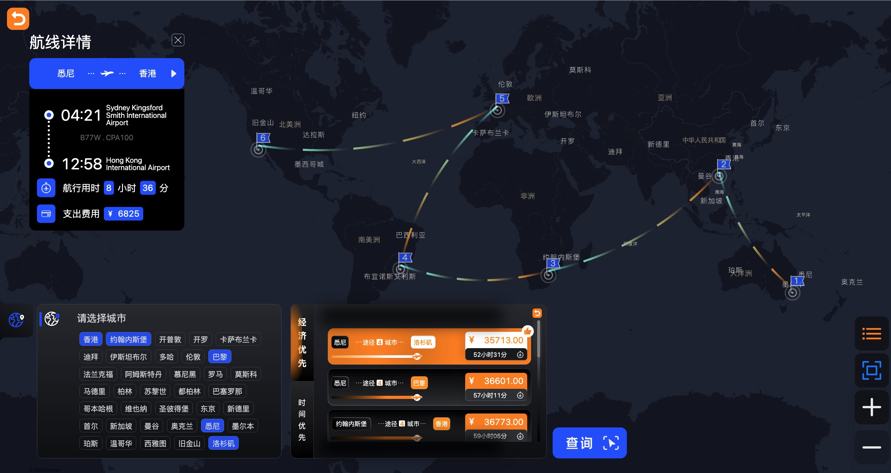

# Round The World Demo

> 此文档主要介绍了环球旅行（Round The World） demo的使用方法

## 1. 简介

基于"80天环游世界"的虚拟背景，基于部分公开历史航班数据，帮助用户设计多个城市的最优航班规划。
- demo设计了自定义网站服务
- 数据来源为国外某开源网站，不包含大陆城市航班数据
- 数据中航班价格为模拟数据，不代表真实价格

## 2. 目录结构

- server：自定义网站服务的文件夹
- download：下载目录，下载脚本和后续下载的文件位于该目录
- raw_data：源数据目录，数据处理脚本、城市文件、下载后的航班数据、处理后的点边数据均位于该目录
- import.json：导入配置文件
- demo.cpp：算法文件
- reload.sh：更新算法的脚本

## 数据说明

### 航班数据

- 数据来源：https://zenodo.org/record/7923702
- 时间范围：2019.1-2022.12
- 航班数量：117258215
- 关键字段：
  - callsign：航班号，可直接使用
  - typecode：航班类型，可直接使用
  - origin/destination：出发/到达机场的icao24编号，可映射为出发/到达城市
  - firstseen/lastseen：出发/到达时间
  - latitude/longitude：出发和到达地点的经纬度

### 机场数据

航班数据中的起始和达到地点提供的是机场信息，而路径规划和前端展示以城市为单元，因此需要将航班数据中的机场信息映射为城市信息。映射数据来源：https://github.com/jpatokal/openflights/blob/master/data/airports-extended.dat

关键信息：
- 第二列：机场名称
- 第三列：城市名称
- 第四列：国家名称
- 第六列：机场icao24编号

### 数据转换

- 根据机场映射信息筛选航班数据，并进行航班-城市映射处理，给出航班的出发和终点城市
- 根据航班出发和结束时间计算时间开销
- 根据经纬度计算距离，再乘以[0.5, 1.5)的随机数模拟机票开销
- 将航班出发和结束时间转换为seconds_from_epoc，添加对应属性

### 图数据

以城市为顶点，以航班为边进行数据导入。设置航班属性start_time_seconds为primary，按照起飞时间进行排序，以减少计算时的排序开销。

## 算法设计

### 输入

- cities：给定城市列表
- interval：航班间隔，乘客在每个城市停留时间，单位为小时
- start_day：开始时间，所选航班时间需要大于该时间
- end_day：结束时间，所选航班时间需要小于该时间

### 输出

- num_flights：航班总数
- num_paths：计算出的路径数量
- total_time：计算时间
- time_first_data：按照时间开销从小到大排序的前十条路径
- cost_first_data：按照机票开销从小到大排序的前十条路径

### 计算流程

1. 根据给定城市列表筛选这些城市之间的航班数据；
2. 根据所有筛选航班数据，每条航班对应初始化一条路线，将所有路线压入栈S
3. 从S中出栈路线path，若path已包含所有城市，将path写入到结果result
4. 若path未包含所有城市，根据path遍历的最后一个城市，选择合适航班，将path+新航班作为new_path压入栈S
5. 重复步骤3、4，直到S为空
6. 返回result

## 一键部署

执行
```bash
    bash control.sh
```
即可部署服务。运行时间较长，执行期间不要中断脚本。

执行完成后，即可在 localhost:8000 或者 {HOST_IP}:8000 页面进行查看。

## 网页示例

### 登录页面


### 查询页面

在登录页面点击后进入查询页面



### 查询示例

在左下角的城市列表中选择不超过8个城市，可返回推荐的航班规划，在满足前后航班间隔在2-6小时的要求下，返回费用最低和飞行时间最短的10条路径规划。



## 详细部署流程

前置条件：TuGraph已安装

### 数据下载

在download目录中调用download.sh，下载单月数据或多线程下载所有数据。

```bash
    bash download.sh [mode]
```

参数：
- mode：值为small或all，分别为下载2020.1月份数据和下载2019-2022全部数据。默认值为small

下载后的数据会进行解压，压缩文件和解压后的文件均在download目录。脚本会将所有解压后的文件合并到../raw_data/flightlist.csv文件中。

### 数据预处理

将机场文件和下载处理后的航班文件进行预处理，转换成导入所需要的点边格式。在raw_data目录下执行
```bash
    python3 convert.py
```
即可进行预处理过程。convert.py的使用说明如下：

```bash
$ python3 convert.py -h
usage: convert.py [-h] [-a AIRPORT_FILE] [-f FLIGHT_FILE] [-v VERTEX_FILE]
                  [-e EDGE_FILE]

flight demo convert manager

optional arguments:
  -h, --help       show this help message and exit
  -a AIRPORT_FILE  airport file path (default: airports-extended.dat)
  -f FLIGHT_FILE   flight file path (default:
                   flightlist.csv)
  -v VERTEX_FILE   output vertex file (default: ./vertex_list)
  -e EDGE_FILE     output edge file (default: ./edge_list)
```

### 数据导入

使用lgraph_import将图数据加载到数据库。若使用默认编译过程，lgraph_import维护[tugraph-db]/build/output目录下。[tugraph-db]为tugraph-db所在路径。执行以下命令：
```bash
    [tugraph-db]/build/output/lgraph_import -c ./raw_data/import.json -d ./lgraph_db --overwrite true --v3 0
```
将图数据导入到lgraph_db目录中。

### 数据库服务启动

使用lgraph_server启动图数据库。lgraph_server所在目录与lgraph_import相同。执行以下命令：
```bash
    [tugraph-db]/build/output/lgraph_server -c ./lgraph_standalone.json -d start --unlimited_token 1
```
启动服务。可通过本机7071端口访问确认导入是否成功。

### 编译算法

将make_demo.sh文件中的 TUGRAPH_PATH改为本机上的tugraph-db目录，执行
```bash
    bash make_demo.sh
    python3 reload.sh
```
即可编译并执行demo算法。在reload.sh中可更改要加载算法的服务器的ip和端口。

### 航班网站服务启动

在server目录下执行
```bash
    npm install
    npm start
```
即可启动航班网站服务。启动后可在 localhost:8000 或者 {HOST_IP}:8000 页面进行查看。详细命令可参考server/READMe.md文件。
